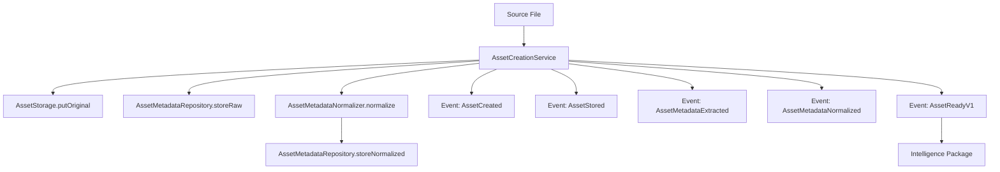
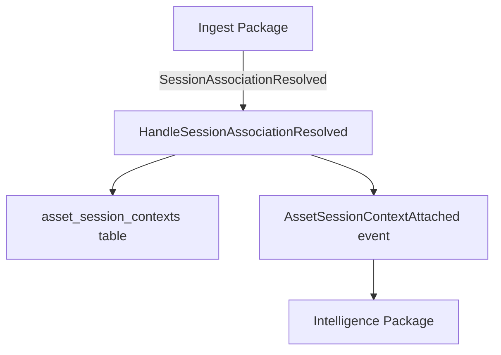
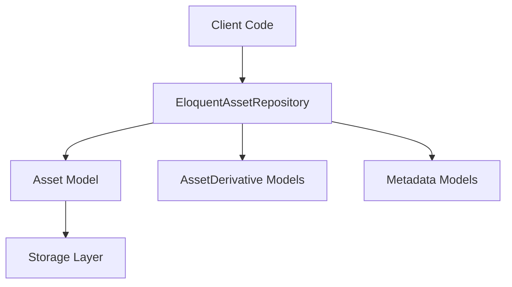

# Dependency Map - ProPhoto Assets Package

## Overview

Complete dependency analysis showing what the assets package imports and what imports from it, along with data flow patterns.

## Import Dependencies (What Assets Uses)

### External Dependencies

#### Laravel Framework
```php
// Core Laravel components
use Illuminate\Support\ServiceProvider;
use Illuminate\Support\Facades\Event;
use Illuminate\Support\Facades\Storage;
use Illuminate\Support\Facades\DB;
use Illuminate\Support\Str;
use Illuminate\Database\Eloquent\Model;
use Illuminate\Database\Eloquent\Relations\HasMany;
use Illuminate\Database\Eloquent\Relations\BelongsTo;
use Illuminate\Database\Eloquent\Builder;
use Illuminate\Database\Eloquent\Factories\HasFactory;
use Illuminate\Console\Command;
use Illuminate\Database\Migrations\Migration;
use Illuminate\Database\Schema\Blueprint;
use Illuminate\Support\Facades\Schema;
use Illuminate\Support\Facades\DateInterval;
use Illuminate\Support\Facades\DateTimeImmutable;
use Illuminate\Support\Facades\DateTimeInterface;
```

#### ProPhoto Contracts (Cross-Package)
```php
// Asset contracts
use ProPhoto\Contracts\Contracts\Asset\AssetPathResolverContract;
use ProPhoto\Contracts\Contracts\Asset\AssetRepositoryContract;
use ProPhoto\Contracts\Contracts\Asset\AssetStorageContract;
use ProPhoto\Contracts\Contracts\Asset\SignedUrlGeneratorContract;

// Metadata contracts
use ProPhoto\Contracts\Contracts\Metadata\AssetMetadataExtractorContract;
use ProPhoto\Contracts\Contracts\Metadata\AssetMetadataNormalizerContract;
use ProPhoto\Contracts\Contracts\Metadata\AssetMetadataRepositoryContract;

// DTOs
use ProPhoto\Contracts\DTOs\AssetId;
use ProPhoto\Contracts\DTOs\AssetQuery;
use ProPhoto\Contracts\DTOs\AssetRecord;
use ProPhoto\Contracts\DTOs\BrowseEntry;
use ProPhoto\Contracts\DTOs\BrowseOptions;
use ProPhoto\Contracts\DTOs\BrowseResult;
use ProPhoto\Contracts\DTOs\MetadataProvenance;
use ProPhoto\Contracts\DTOs\RawMetadataBundle;
use ProPhoto\Contracts\DTOs\NormalizedAssetMetadata;
use ProPhoto\Contracts\DTOs\AssetMetadataSnapshot;

// Enums
use ProPhoto\Contracts\Enums\AssetType;
use ProPhoto\Contracts\Enums\DerivativeType;
use ProPhoto\Contracts\Enums\MetadataScope;

// Events (Consumed)
use ProPhoto\Contracts\Events\Ingest\SessionAssociationResolved;

// Events (Emitted - defined in contracts)
use ProPhoto\Contracts\Events\Asset\AssetCreated;
use ProPhoto\Contracts\Events\Asset\AssetStored;
use ProPhoto\Contracts\Events\Asset\AssetMetadataExtracted;
use ProPhoto\Contracts\Events\Asset\AssetMetadataNormalized;
use ProPhoto\Contracts\Events\Asset\AssetReadyV1;
```

### Internal Dependencies

#### Model Relationships
```php
// Within package - Eloquent relationships
use ProPhoto\Assets\Models\Asset;
use ProPhoto\Assets\Models\AssetDerivative;
use ProPhoto\Assets\Models\AssetMetadataRaw;
use ProPhoto\Assets\Models\AssetMetadataNormalized;
```

## Export Dependencies (What Uses Assets)

### Direct Consumers

#### ProPhoto Intelligence
- **Consumes**: `AssetSessionContextAttached` events
- **Uses**: Asset metadata for intelligence processing
- **Access Pattern**: Event-driven only (no direct DB access)

#### ProPhoto Gallery (Future)
- **Uses**: Asset repository for display
- **Access Pattern**: Repository contracts

#### ProPhoto AI (Future)
- **Uses**: Asset storage and metadata
- **Access Pattern**: Service contracts

### Indirect Consumers

#### Any Package Needing Asset Information
- **Access Via**: `AssetRepositoryContract`
- **Pattern**: Contract-based dependency injection
- **Examples**: Gallery, AI, future domain packages

## Data Flow Analysis

### Primary Data Flow: Asset Creation



### Secondary Data Flow: Session Association



### Tertiary Data Flow: Asset Query



## Dependency Direction Analysis

### Upstream Dependencies (Assets Depends On)
1. **Laravel Framework** - Infrastructure layer
2. **ProPhoto Contracts** - Shared kernel (no circular dependencies)

### Downstream Dependencies (Depend on Assets)
1. **ProPhoto Intelligence** - Event consumer
2. **ProPhoto Gallery** - Repository consumer (future)
3. **ProPhoto AI** - Service consumer (future)

### Peer Dependencies (Same Level)
- **ProPhoto Ingest** - Event producer/consumer relationship
- **ProPhoto Booking** - Referenced via session context only

## Contract Boundaries

### Input Contracts (Assets Implements)
- `AssetRepositoryContract` - Asset querying and browsing
- `AssetStorageContract` - File storage operations
- `SignedUrlGeneratorContract` - URL generation
- `AssetPathResolverContract` - Path resolution
- `AssetMetadataRepositoryContract` - Metadata persistence
- `AssetMetadataExtractorContract` - Metadata extraction
- `AssetMetadataNormalizerContract` - Metadata normalization

### Output Contracts (Assets Emits)
- `AssetCreated` - New asset registered
- `AssetStored` - File stored successfully
- `AssetMetadataExtracted` - Raw metadata available
- `AssetMetadataNormalized` - Normalized metadata ready
- `AssetReadyV1` - Asset fully processed
- `AssetSessionContextAttached` - Session context linked

### Input Events (Assets Consumes)
- `SessionAssociationResolved` - From ingest package

## Integration Patterns

### Event-Driven Integration
```php
// Clean event-driven boundary
Event::listen(SessionAssociationResolved::class, HandleSessionAssociationResolved::class);

// Emits domain events
event(new AssetSessionContextAttached(...));
event(new AssetReadyV1(...));
```

### Contract-Based Integration
```php
// No direct coupling to other packages
public function __construct(
    private readonly AssetStorageContract $assetStorage,
    private readonly AssetMetadataRepositoryContract $metadataRepository,
) {}
```

### Database Integration
```php
// Foreign key relationships (allowed downstream)
public function derivatives(): HasMany
{
    return $this->hasMany(AssetDerivative::class);
}

// No upstream relationships (rule compliance)
```

## Dependency Health

### Strengths
- **Clear Boundaries**: All cross-package communication via contracts/events
- **No Circular Dependencies**: Proper one-way dependency flow
- **Contract-Driven**: Strong interface segregation
- **Event Isolation**: Clean event-driven patterns

### Considerations
- **Contract Coupling**: Heavy reliance on prophoto-contracts
- **Event Ordering**: Dependency on correct event sequence
- **Storage Abstraction**: Multiple storage contract implementations

### Risk Areas
- **Contract Changes**: Breaking changes in contracts would impact assets
- **Event Schema**: Event contract changes require coordinated updates
- **Storage Drivers**: New storage drivers may need contract extensions

## External Service Dependencies

### Storage Services
- **Laravel Storage**: Abstracted via contracts
- **File System**: Local, S3, etc. via Laravel
- **Temporary URLs**: Depends on storage driver capabilities

### Metadata Services
- **Null Extractor**: Default no-op implementation
- **Pass-Through Normalizer**: Basic normalization logic
- **Future Extractors**: Could integrate ExifTool, FFprobe, etc.

## Dependency Summary

| Dependency Type | Count | Examples |
|----------------|-------|----------|
| Laravel Classes | 15+ | Model, Storage, Console |
| Contract Interfaces | 7 | AssetRepositoryContract, etc. |
| Contract DTOs | 8 | AssetId, AssetQuery, etc. |
| Contract Enums | 3 | AssetType, DerivativeType, etc. |
| Contract Events | 6 | AssetCreated, etc. |
| Internal Models | 5 | Asset, derivatives, metadata |

**Total External Dependencies**: ~40 classes/interfaces
**Internal Dependencies**: 5 model relationships
**Cross-Package Events**: 1 consumed, 5 emitted

---

*Dependency analysis shows proper architectural compliance with event-driven boundaries and contract-based integration.*
