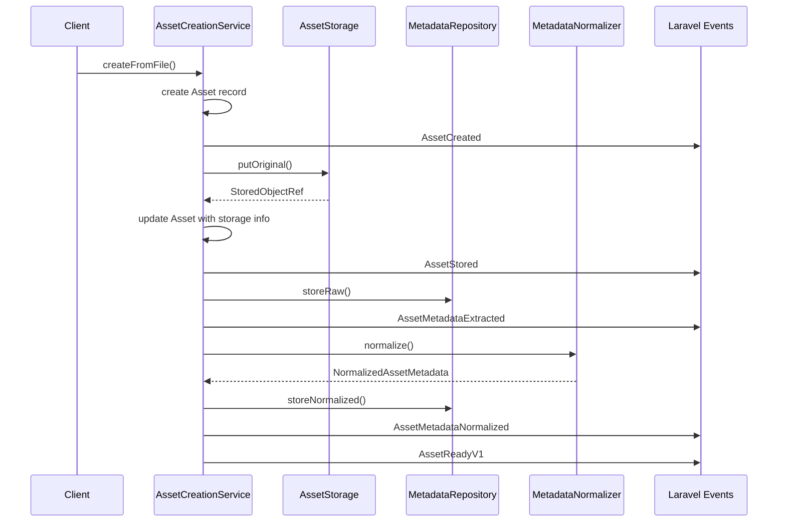
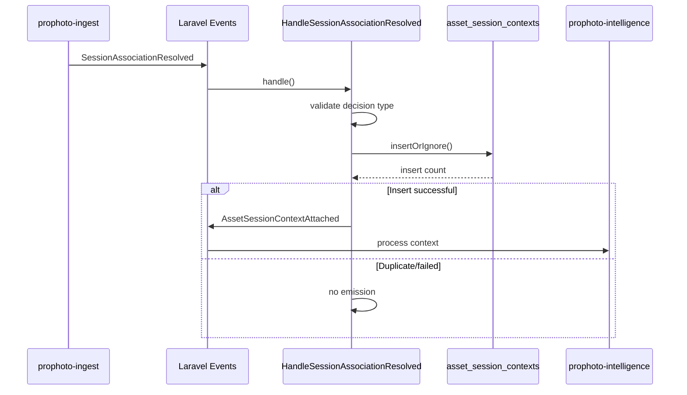

# Event Contracts - ProPhoto Assets Package

## Overview

Complete analysis of event consumption and emission patterns in the assets package, showing how it participates in the ProPhoto event loop.

## Event Consumption (Assets Listens To)

### SessionAssociationResolved
- **Source**: `prophoto-ingest` package
- **Contract Location**: `prophoto-contracts\Events\Ingest\SessionAssociationResolved`
- **Handler**: `HandleSessionAssociationResolved`
- **Purpose**: Consume ingest decisions and persist asset session context

#### Event Schema
```php
new SessionAssociationResolved(
    decisionId: string,           // Unique decision identifier
    decisionType: SessionAssignmentDecisionType,  // AUTO_ASSIGN, NO_MATCH, PROPOSE
    subjectType: SessionAssociationSubjectType,    // ASSET, BATCH
    subjectId: string,            // Asset ID or batch identifier
    ingestItemId: ?string,        // Original ingest item reference
    assetId: ?int,               // Canonical asset ID (if available)
    selectedSessionId: ?int,     // Selected session ID (if assigned)
    confidenceTier: ?SessionMatchConfidenceTier,  // HIGH, MEDIUM, LOW
    confidenceScore: ?float,     // 0.0-1.0 confidence score
    algorithmVersion: string,    // Matching algorithm version
    occurredAt: string,          // ISO 8601 timestamp
)
```

#### Handling Logic
```php
public function handle(SessionAssociationResolved $event): void
{
    // Only process automatic assignments
    if ($event->decisionType !== SessionAssignmentDecisionType::AUTO_ASSIGN) {
        return;
    }

    // Validate required fields
    if ($event->assetId === null || $event->selectedSessionId === null) {
        return;
    }

    // Idempotent insert using unique decision ID
    $inserted = DB::table('asset_session_contexts')->insertOrIgnore([
        'asset_id' => $event->assetId,
        'session_id' => $event->selectedSessionId,
        'source_decision_id' => (string) $event->decisionId,
        'decision_type' => $event->decisionType->value,
        'subject_type' => $event->subjectType->value,
        'subject_id' => $event->subjectId,
        'ingest_item_id' => $event->ingestItemId === null ? null : (string) $event->ingestItemId,
        'confidence_tier' => $event->confidenceTier?->value,
        'confidence_score' => $event->confidenceScore,
        'algorithm_version' => $event->algorithmVersion,
        'occurred_at' => $event->occurredAt,
        'created_at' => now('UTC')->toISOString(),
        'updated_at' => now('UTC')->toISOString(),
    ]);

    // Only emit if new context was created
    if ((int) $inserted < 1) {
        return;
    }

    // Emit downstream event
    Event::dispatch(new AssetSessionContextAttached(
        assetId: $event->assetId,
        sessionId: $event->selectedSessionId,
        sourceDecisionId: $event->decisionId,
        triggerSource: 'asset_session_context',
        occurredAt: $event->occurredAt
    ));
}
```

#### Processing Rules
- **Decision Type Filter**: Only processes `AUTO_ASSIGN` decisions
- **Required Fields**: Must have both `assetId` and `selectedSessionId`
- **Idempotency**: Uses `insertOrIgnore` with unique `source_decision_id`
- **Emission Condition**: Only emits `AssetSessionContextAttached` on successful insert
- **Data Integrity**: Preserves all decision metadata for audit trail

## Event Emission (Assets Emits)

### AssetCreated
- **Trigger**: Asset record creation in `AssetCreationService` and `AssetRegistrar`
- **Purpose**: Signal new asset registration
- **Consumers**: Intelligence package, logging, analytics

#### Event Schema
```php
new AssetCreated(
    assetId: AssetId,            // Canonical asset identifier
    studioId: string,             // Studio context
    type: AssetType,             // Asset type (JPEG, RAW, VIDEO, etc.)
    logicalPath: string,          // Logical path within studio
    occurredAt: string,           // ISO 8601 timestamp
)
```

#### Emission Points
```php
// In AssetCreationService::createFromFile()
event(new AssetCreated(
    assetId: AssetId::from($asset->id),
    studioId: $asset->studio_id,
    type: $this->resolveAssetType($originalFilename, $mimeType),
    logicalPath: (string) $asset->logical_path,
    occurredAt: $occurredAt,
));

// In AssetRegistrar::register()
event(new AssetCreated(
    assetId: AssetId::from($asset->id),
    studioId: $asset->studio_id,
    type: AssetType::tryFrom((string) $asset->type) ?? AssetType::UNKNOWN,
    logicalPath: (string) $asset->logical_path,
    occurredAt: now()->toISOString(),
));
```

### AssetStored
- **Trigger**: Successful file storage in `AssetCreationService`
- **Purpose**: Confirm physical file persistence
- **Consumers**: Storage monitoring, backup systems

#### Event Schema
```php
new AssetStored(
    assetId: AssetId,            // Canonical asset identifier
    storageDriver: string,       // Storage backend used
    storageKeyOriginal: string,  // Storage location key
    bytes: int,                  // File size in bytes
    checksumSha256: string,      // File integrity hash
    occurredAt: string,           // ISO 8601 timestamp
)
```

#### Emission Logic
```php
event(new AssetStored(
    assetId: AssetId::from($asset->id),
    storageDriver: (string) $asset->storage_driver,
    storageKeyOriginal: (string) $asset->storage_key_original,
    bytes: (int) ($asset->bytes ?? 0),
    checksumSha256: (string) $asset->checksum_sha256,
    occurredAt: $occurredAt,
));
```

### AssetMetadataExtracted
- **Trigger**: Raw metadata storage in `AssetCreationService`
- **Purpose**: Signal availability of raw metadata
- **Consumers**: Metadata processing, indexing

#### Event Schema
```php
new AssetMetadataExtracted(
    assetId: AssetId,            // Canonical asset identifier
    source: string,              // Metadata extraction source
    extractedAt: string,         // When extraction occurred
    occurredAt: string,           // ISO 8601 timestamp
)
```

### AssetMetadataNormalized
- **Trigger**: Normalized metadata storage in `AssetCreationService`
- **Purpose**: Signal processed metadata availability
- **Consumers**: Search indexing, analytics, UI display

#### Event Schema
```php
new AssetMetadataNormalized(
    assetId: AssetId,            // Canonical asset identifier
    schemaVersion: string,       // Normalization schema version
    normalizedAt: string,        // When normalization occurred
    occurredAt: string,           // ISO 8601 timestamp
)
```

### AssetReadyV1
- **Trigger**: End of asset creation pipeline in `AssetCreationService`
- **Purpose**: Signal asset is fully processed and available
- **Consumers**: Intelligence package, downstream processing

#### Event Schema
```php
new AssetReadyV1(
    assetId: AssetId,                    // Canonical asset identifier
    studioId: string,                     // Studio context
    status: string,                       // Asset status (ready, processing, etc.)
    hasOriginal: bool,                    // Original file available
    hasNormalizedMetadata: bool,          // Normalized metadata available
    hasDerivatives: bool,                 // Derivatives generated
    occurredAt: string,                    // ISO 8601 timestamp
)
```

#### Emission Logic
```php
event(new AssetReadyV1(
    assetId: AssetId::from($asset->id),
    studioId: $asset->studio_id,
    status: (string) $asset->status,
    hasOriginal: true,
    hasNormalizedMetadata: true,
    hasDerivatives: false,
    occurredAt: $occurredAt,
));
```

### AssetSessionContextAttached
- **Trigger**: Successful session context persistence
- **Purpose**: Signal asset-session association
- **Consumers**: Intelligence package, session analytics

#### Event Schema
```php
new AssetSessionContextAttached(
    assetId: int|string,         // Canonical asset identifier
    sessionId: int|string,       // Session identifier
    sourceDecisionId: int|string, // Original decision reference
    triggerSource: string,       // What triggered this attachment
    occurredAt: string,          // ISO 8601 timestamp
)
```

## Event Flow Sequence

### Complete Asset Creation Flow


### Session Association Flow


## Event Contract Analysis

### Event Design Patterns

#### Immutable Events
- All events are readonly classes
- No modification after creation
- Versioned when structure changes

#### ID-Based Payloads
- Events carry IDs, not full models
- Prevents object coupling across packages
- Enables lazy loading by consumers

#### Timestamp Consistency
- All events include `occurredAt` field
- ISO 8601 format for consistency
- Preserves event ordering

#### Context Preservation
- Events carry sufficient context for downstream processing
- No need for additional database queries by consumers
- Maintains event autonomy

### Event Ordering Guarantees

#### Within Asset Creation
1. `AssetCreated` - Asset record exists
2. `AssetStored` - File persisted
3. `AssetMetadataExtracted` - Raw metadata available
4. `AssetMetadataNormalized` - Processed metadata available
5. `AssetReadyV1` - Asset fully processed

#### Cross-Package Flow
1. Ingest emits `SessionAssociationResolved`
2. Assets processes and emits `AssetSessionContextAttached`
3. Intelligence consumes context for derived work

### Error Handling Patterns

#### Event Emission Safety
- Events are emitted after successful operations
- No rollback mechanisms needed
- Failed operations don't emit events

#### Idempotency Guarantees
- Session context uses unique decision IDs
- Duplicate events result in no-op inserts
- Prevents duplicate downstream processing

#### Validation Before Emission
- All required fields validated before event creation
- Type safety through readonly constructors
- Early failure with clear error messages

## Event Integration Health

### Strengths
- **Clear Boundaries**: Events define package interfaces
- **Loose Coupling**: No direct cross-package dependencies
- **Scalable**: Event-driven architecture supports horizontal scaling
- **Auditable**: All state changes have corresponding events

### Considerations
- **Event Ordering**: Consumers must handle out-of-order events
- **Event Volume**: High-frequency asset creation could generate event storms
- **Event Schema**: Breaking changes require coordinated updates
- **Event Persistence**: No event store for replay capabilities

### Monitoring Points
- Event emission frequency and patterns
- Event processing latency
- Failed event handling
- Event schema validation errors

## Event Statistics

| Event | Source | Destination | Frequency | Criticality |
|-------|--------|-------------|-----------|-------------|
| SessionAssociationResolved | Ingest | Assets | Medium | High |
| AssetCreated | Assets | Intelligence | High | High |
| AssetStored | Assets | Monitoring | High | Medium |
| AssetMetadataExtracted | Assets | Indexing | High | Medium |
| AssetMetadataNormalized | Assets | Search | High | Medium |
| AssetReadyV1 | Assets | Intelligence | High | High |
| AssetSessionContextAttached | Assets | Intelligence | Medium | High |

**Total Events**: 7 (1 consumed, 6 emitted)
**Critical Path**: SessionAssociationResolved -> AssetSessionContextAttached
**High Volume**: Asset creation events (potentially thousands/hour)

---

*Event contracts show proper event-driven architecture with clear boundaries and reliable cross-package communication.*
