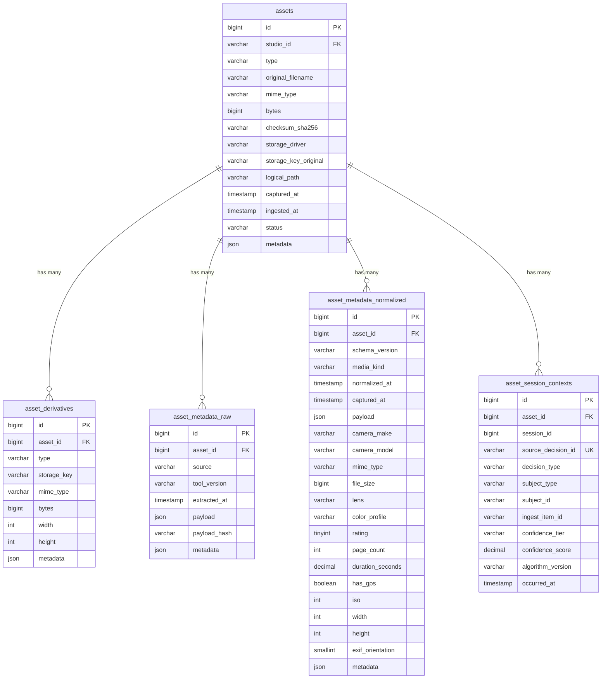
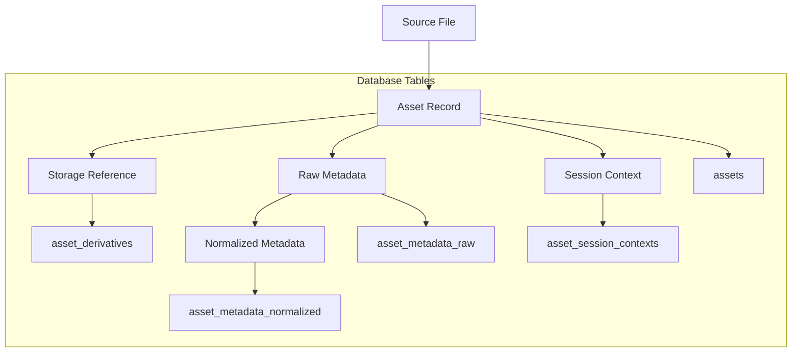
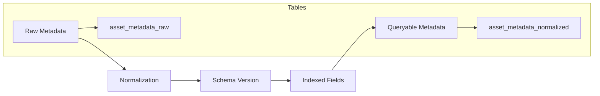
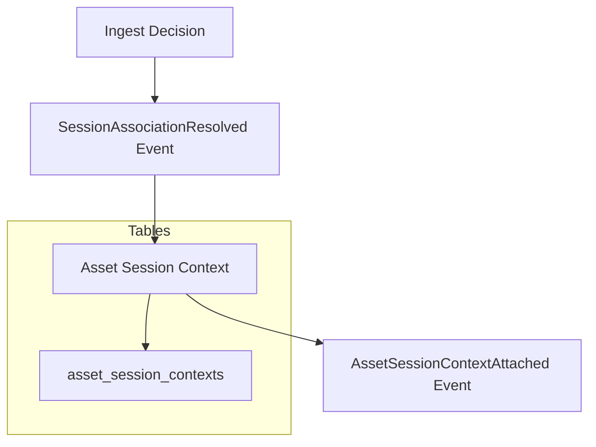

# Data Model - ProPhoto Assets Package

## Overview

Complete analysis of the assets package data model, including table schemas, relationships, migration sequence, and architectural patterns.

## Database Schema

### Core Tables

#### assets
The canonical asset record - the Asset Spine of the system.

```sql
CREATE TABLE assets (
    id BIGINT PRIMARY KEY AUTO_INCREMENT,
    studio_id VARCHAR(255) NOT NULL INDEX,
    organization_id VARCHAR(255) NULL INDEX,
    type VARCHAR(32) NOT NULL INDEX,
    original_filename VARCHAR(255) NOT NULL,
    mime_type VARCHAR(191) NOT NULL INDEX,
    bytes BIGINT UNSIGNED NULL,
    checksum_sha256 VARCHAR(64) NOT NULL INDEX,
    storage_driver VARCHAR(64) NOT NULL DEFAULT 'local',
    storage_key_original VARCHAR(1024) NOT NULL,
    logical_path VARCHAR(512) NOT NULL DEFAULT '' INDEX,
    captured_at TIMESTAMP NULL INDEX,
    ingested_at TIMESTAMP NULL INDEX,
    status VARCHAR(32) NOT NULL DEFAULT 'pending' INDEX,
    metadata JSON NULL,
    created_at TIMESTAMP DEFAULT CURRENT_TIMESTAMP,
    updated_at TIMESTAMP DEFAULT CURRENT_TIMESTAMP ON UPDATE CURRENT_TIMESTAMP,
    
    INDEX idx_assets_studio_checksum (studio_id, checksum_sha256)
);
```

**Key Design Decisions**:
- **Composite Index**: `(studio_id, checksum_sha256)` prevents duplicate uploads within studio
- **Logical Path**: Supports hierarchical organization within studios
- **Status Field**: Enables asset lifecycle tracking
- **Metadata JSON**: Flexible extensible metadata storage

#### asset_derivatives
Processed asset derivatives (thumbnails, resized versions, etc.).

```sql
CREATE TABLE asset_derivatives (
    id BIGINT PRIMARY KEY AUTO_INCREMENT,
    asset_id BIGINT NOT NULL,
    type VARCHAR(32) NOT NULL INDEX,
    storage_key VARCHAR(1024) NOT NULL,
    mime_type VARCHAR(191) NULL,
    bytes BIGINT UNSIGNED NULL,
    width INT UNSIGNED NULL,
    height INT UNSIGNED NULL,
    metadata JSON NULL,
    created_at TIMESTAMP DEFAULT CURRENT_TIMESTAMP,
    updated_at TIMESTAMP DEFAULT CURRENT_TIMESTAMP ON UPDATE CURRENT_TIMESTAMP,
    
    FOREIGN KEY (asset_id) REFERENCES assets(id) ON DELETE CASCADE,
    INDEX idx_asset_derivatives_asset_type (asset_id, type)
);
```

**Key Design Decisions**:
- **Cascade Delete**: Derivatives removed when asset deleted
- **Type Index**: Fast lookup of specific derivative types
- **Dimensions**: Stores width/height for image derivatives
- **Flexible Storage**: Supports various derivative formats

#### asset_metadata_raw
Immutable raw metadata extraction records.

```sql
CREATE TABLE asset_metadata_raw (
    id BIGINT PRIMARY KEY AUTO_INCREMENT,
    asset_id BIGINT NOT NULL,
    source VARCHAR(100) NOT NULL,
    tool_version VARCHAR(100) NULL,
    extracted_at TIMESTAMP NULL,
    payload JSON NOT NULL,
    payload_hash VARCHAR(64) NULL,
    metadata JSON NULL,
    created_at TIMESTAMP DEFAULT CURRENT_TIMESTAMP,
    updated_at TIMESTAMP DEFAULT CURRENT_TIMESTAMP ON UPDATE CURRENT_TIMESTAMP,
    
    FOREIGN KEY (asset_id) REFERENCES assets(id) ON DELETE CASCADE,
    INDEX idx_asset_metadata_raw_asset_source (asset_id, source)
);
```

**Key Design Decisions**:
- **Immutable**: Raw metadata never modified, preserves extraction history
- **Source Tracking**: Identifies extraction tool/version
- **Payload Hash**: Enables duplicate detection
- **Append-Only**: Supports multiple extraction attempts

#### asset_metadata_normalized
Queryable normalized metadata projection.

```sql
CREATE TABLE asset_metadata_normalized (
    id BIGINT PRIMARY KEY AUTO_INCREMENT,
    asset_id BIGINT NOT NULL,
    schema_version VARCHAR(64) NOT NULL,
    media_kind VARCHAR(32) NULL INDEX,
    normalized_at TIMESTAMP NULL INDEX,
    captured_at TIMESTAMP NULL,
    payload JSON NOT NULL,
    camera_make VARCHAR(128) NULL INDEX,
    camera_model VARCHAR(191) NULL,
    mime_type VARCHAR(191) NULL INDEX,
    file_size BIGINT UNSIGNED NULL,
    lens VARCHAR(191) NULL,
    color_profile VARCHAR(191) NULL,
    rating TINYINT UNSIGNED NULL INDEX,
    page_count INT UNSIGNED NULL,
    duration_seconds DECIMAL(12,4) NULL,
    has_gps BOOLEAN DEFAULT FALSE INDEX,
    iso INT UNSIGNED NULL,
    width INT UNSIGNED NULL,
    height INT UNSIGNED NULL,
    exif_orientation SMALLINT UNSIGNED NULL,
    metadata JSON NULL,
    created_at TIMESTAMP DEFAULT CURRENT_TIMESTAMP,
    updated_at TIMESTAMP DEFAULT CURRENT_TIMESTAMP ON UPDATE CURRENT_TIMESTAMP,
    
    FOREIGN KEY (asset_id) REFERENCES assets(id) ON DELETE CASCADE,
    INDEX idx_asset_metadata_normalized_asset_schema (asset_id, schema_version)
);
```

**Key Design Decisions**:
- **Schema Versioning**: Supports evolution of normalization format
- **Extensive Indexing**: Optimized for common query patterns
- **Denormalized Fields**: Frequently queried metadata as columns
- **Update Pattern**: `updateOrCreate` allows schema evolution

#### asset_session_contexts
Asset-to-session association projection table.

```sql
CREATE TABLE asset_session_contexts (
    id BIGINT PRIMARY KEY AUTO_INCREMENT,
    asset_id BIGINT NOT NULL INDEX,
    session_id BIGINT NULL INDEX,
    source_decision_id VARCHAR(191) NOT NULL UNIQUE,
    decision_type VARCHAR(32) NOT NULL INDEX,
    subject_type VARCHAR(32) NOT NULL INDEX,
    subject_id VARCHAR(191) NOT NULL,
    ingest_item_id VARCHAR(191) NULL,
    confidence_tier VARCHAR(16) NULL,
    confidence_score DECIMAL(6,5) NULL,
    algorithm_version VARCHAR(64) NOT NULL,
    occurred_at TIMESTAMP NOT NULL,
    created_at TIMESTAMP DEFAULT CURRENT_TIMESTAMP,
    updated_at TIMESTAMP DEFAULT CURRENT_TIMESTAMP ON UPDATE CURRENT_TIMESTAMP,
    
    FOREIGN KEY (asset_id) REFERENCES assets(id) ON DELETE CASCADE
);
```

**Key Design Decisions**:
- **Unique Decision ID**: Prevents duplicate associations
- **Confidence Tracking**: Stores matching algorithm confidence
- **Decision History**: Preserves original ingest decision context
- **Projection Pattern**: Read-optimized for intelligence consumption

## Relationship Diagram



## Migration Sequence

### Phase 1: Core Asset Tables (2026-03-08)

1. **assets** - Foundation table
2. **asset_derivatives** - Asset relationships
3. **asset_metadata_raw** - Raw metadata storage
4. **asset_metadata_normalized** - Initial normalized metadata

### Phase 2: Metadata Expansion (2026-03-09)

5. **expand_asset_metadata_normalized_index_columns** - Added extensive indexing

### Phase 3: Session Integration (2026-04-05)

6. **asset_session_contexts** - Session association projection

## Data Flow Patterns

### Asset Creation Flow


### Metadata Processing Flow


### Session Association Flow


## Indexing Strategy

### Primary Indexes
- **assets.id** - Primary key, auto-increment
- **asset_derivatives.id** - Primary key, auto-increment
- **asset_metadata_raw.id** - Primary key, auto-increment
- **asset_metadata_normalized.id** - Primary key, auto-increment
- **asset_session_contexts.id** - Primary key, auto-increment

### Foreign Key Indexes
- **asset_derivatives.asset_id** - Fast derivative lookup
- **asset_metadata_raw.asset_id** - Raw metadata lookup
- **asset_metadata_normalized.asset_id** - Normalized metadata lookup
- **asset_session_contexts.asset_id** - Session context lookup

### Query Optimization Indexes

#### assets Table
- **studio_id** - Studio-scoped queries
- **type** - Asset type filtering
- **mime_type** - Media type filtering
- **checksum_sha256** - Duplicate detection
- **logical_path** - Hierarchical browsing
- **captured_at** - Time-based queries
- **ingested_at** - Ingest timeline
- **status** - Lifecycle filtering
- **idx_assets_studio_checksum** - Duplicate prevention

#### asset_metadata_normalized Table
- **schema_version** - Version filtering
- **media_kind** - Media type queries
- **captured_at** - Time-based filtering
- **camera_make** - Equipment filtering
- **camera_model** - Equipment filtering
- **mime_type** - Format filtering
- **rating** - Rating-based queries
- **has_gps** - Location-based filtering
- **iso** - Exposure filtering

#### asset_session_contexts Table
- **session_id** - Session-based queries
- **decision_type** - Decision filtering
- **subject_type** - Subject filtering
- **source_decision_id** - Unique constraint

## Data Integrity Constraints

### Foreign Key Constraints
- **Cascade Delete**: Child records deleted when parent asset removed
- **Referential Integrity**: All foreign keys must reference valid assets

### Unique Constraints
- **source_decision_id**: Prevents duplicate session associations
- **Composite Index**: `(studio_id, checksum_sha256)` prevents duplicates

### Data Validation
- **Enum Constraints**: Decision types, media kinds via application logic
- **Type Safety**: Proper column types with size limits
- **JSON Schema**: Application-level validation for JSON columns

## Performance Considerations

### Read Optimization
- **Extensive Indexing**: Optimized for common query patterns
- **Denormalized Fields**: Frequently accessed metadata as columns
- **Composite Indexes**: Multi-column query optimization

### Write Performance
- **Minimal Indexing**: No unnecessary indexes on write-heavy tables
- **JSON Storage**: Flexible metadata without schema changes
- **Cascade Deletes**: Automatic cleanup without additional queries

### Storage Optimization
- **Appropriate Types**: BIGINT for IDs, appropriate sizes for other fields
- **JSON Columns**: Efficient storage for structured metadata
- **Index Strategy**: Balance between query performance and storage overhead

## Scaling Patterns

### Horizontal Scaling
- **Studio Isolation**: Natural sharding by studio_id
- **Asset Distribution**: Even distribution across storage nodes
- **Metadata Partitioning**: Could partition by asset_id ranges

### Query Performance
- **Covering Indexes**: Queries satisfied from indexes alone
- **Materialized Views**: Potential for aggregated metadata views
- **Read Replicas**: Metadata queries can use read replicas

### Storage Growth
- **Metadata Bloat**: JSON columns can grow, monitor sizes
- **Derivative Management**: Derivative table can grow significantly
- **Archive Strategy**: Old assets could be archived to cold storage

## Data Model Evolution

### Versioning Strategy
- **Schema Version**: Normalized metadata includes version field
- **Backward Compatibility**: Multiple schema versions can coexist
- **Migration Path**: Gradual migration between schema versions

### Extension Points
- **JSON Metadata**: Flexible extension without schema changes
- **New Asset Types**: Enum values can be added
- **Additional Derivatives**: New derivative types supported
- **Enhanced Indexing**: New indexes can be added without downtime

### Migration Considerations
- **Zero Downtime**: Migrations designed for online schema changes
- **Rollback Support**: All migrations include down methods
- **Data Preservation**: No destructive operations in migrations

---

*Data model analysis shows a well-designed schema that balances normalization, performance, and flexibility while maintaining clear architectural boundaries.*
