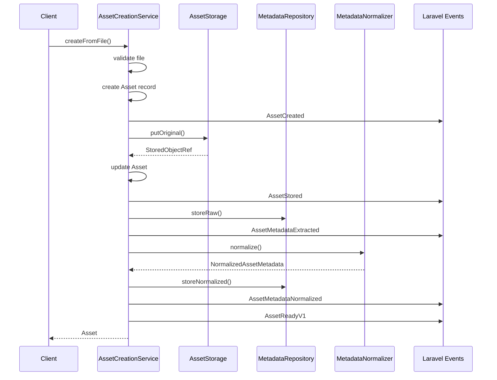
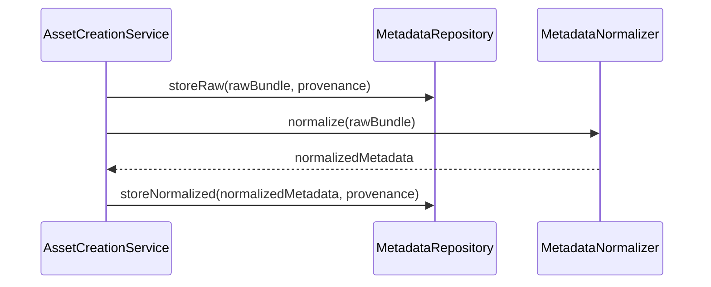
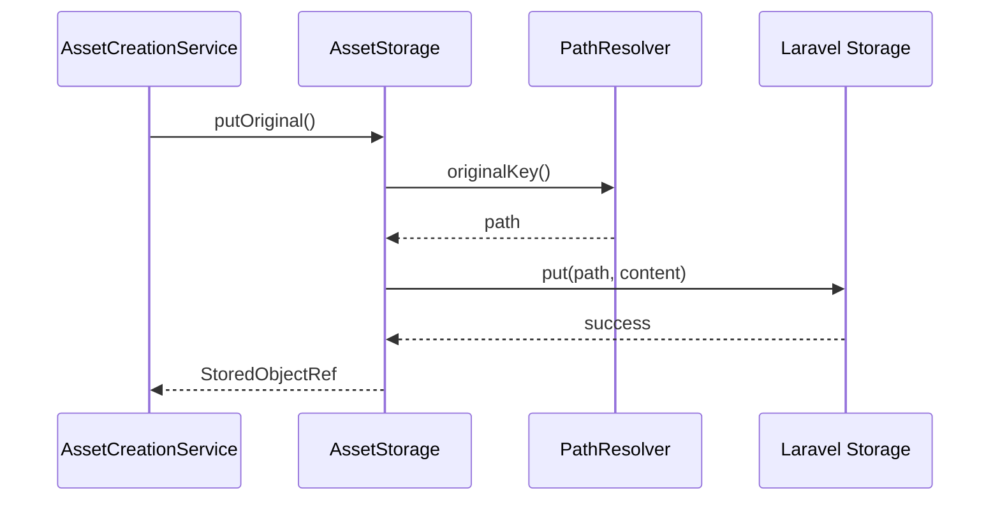

# Service Layer - ProPhoto Assets Package

## Overview

Complete analysis of the service layer architecture, including service responsibilities, implementation patterns, error handling, and coordination patterns.

## Service Architecture

### Service Categories

#### Core Asset Services
- **AssetCreationService** - End-to-end asset creation pipeline
- **AssetRegistrar** - Simple asset registration
- **EloquentAssetRepository** - Asset querying and browsing

#### Metadata Services
- **EloquentAssetMetadataRepository** - Metadata persistence
- **PassThroughAssetMetadataNormalizer** - Metadata normalization
- **NullAssetMetadataExtractor** - No-op metadata extraction

#### Storage Services
- **LaravelAssetStorage** - File storage abstraction
- **LaravelSignedUrlGenerator** - URL generation for access
- **DefaultAssetPathResolver** - Storage path resolution

## Service Analysis

### AssetCreationService

#### Purpose
End-to-end asset creation pipeline that coordinates storage, metadata processing, and event emission.

#### Dependencies
```php
public function __construct(
    private readonly AssetStorageContract $assetStorage,
    private readonly AssetMetadataRepositoryContract $metadataRepository,
    private readonly AssetMetadataNormalizerContract $metadataNormalizer,
) {}
```

#### Key Methods

##### createFromFile(string $sourcePath, array $attributes): Asset
**Responsibility**: Complete asset creation from local file

**Flow**:
1. Validate source file exists
2. Extract file attributes (size, MIME type, checksum)
3. Create Asset record in database
4. Emit AssetCreated event
5. Store file via storage service
6. Update asset with storage information
7. Emit AssetStored event
8. Extract and store raw metadata
9. Emit AssetMetadataExtracted event
10. Normalize metadata
11. Store normalized metadata
12. Emit AssetMetadataNormalized event
13. Emit AssetReadyV1 event

**Error Handling**:
- `InvalidArgumentException` for non-existent files
- Storage failures handled by storage service
- Metadata failures don't prevent asset creation

##### resolveAssetType(string $filename, string $mimeType): AssetType
**Responsibility**: Determine asset type from file information

**Logic**:
```php
if (str_starts_with(strtolower($mimeType), 'video/')) {
    return AssetType::VIDEO;
}

return match (strtolower((string) pathinfo($filename, PATHINFO_EXTENSION))) {
    'jpg', 'jpeg' => AssetType::JPEG,
    'heic', 'heif' => AssetType::HEIC,
    'png' => AssetType::PNG,
    'raw', 'dng', 'cr2', 'cr3', 'nef', 'arw', 'raf', 'orf', 'rw2' => AssetType::RAW,
    default => AssetType::UNKNOWN,
};
```

**Design Notes**:
- MIME type takes precedence for video detection
- Extension-based detection for images
- Comprehensive RAW format support

#### Event Emission Pattern
```php
$assetId = AssetId::from($asset->id);
$occurredAt = now()->toISOString();

event(new AssetCreated(...));
event(new AssetStored(...));
event(new AssetMetadataExtracted(...));
event(new AssetMetadataNormalized(...));
event(new AssetReadyV1(...));
```

**Sequence Guarantees**:
1. Asset record exists before storage
2. Storage completed before metadata processing
3. All metadata processed before ready signal

### AssetRegistrar

#### Purpose
Simple asset registration without full pipeline for additive use cases.

#### Key Methods

##### register(array $attributes): Asset
**Responsibility**: Basic asset creation with minimal processing

**Differences from AssetCreationService**:
- No file storage
- No metadata processing
- No MIME type detection
- Simpler event emission (AssetCreated, AssetStored only)

**Use Cases**:
- Asset migration scenarios
- Manual asset registration
- Testing and development

### EloquentAssetRepository

#### Purpose
Asset querying and browsing with comprehensive filtering capabilities.

#### Key Methods

##### find(AssetId $assetId): ?AssetRecord
**Responsibility**: Single asset lookup by ID

**Implementation**:
```php
$asset = Asset::query()->find($assetId->value);
return $asset ? $this->mapRecord($asset) : null;
```

##### list(AssetQuery $query): array
**Responsibility**: Filtered asset listing with pagination

**Filtering Capabilities**:
- Studio filtering
- Asset type filtering
- Logical path prefix matching
- Status filtering
- Custom extra filters (mime_type, checksum, storage_driver, status)

**Query Building**:
```php
$builder = Asset::query();

if ($query->studioId !== null) {
    $builder->where('studio_id', (string) $query->studioId);
}

if ($query->type !== null) {
    $builder->where('type', $query->type->value);
}

// Additional filters...
```

##### browse(string $prefixPath, ?BrowseOptions $options): BrowseResult
**Responsibility**: Directory-style asset browsing

**Features**:
- File and folder listing
- Recursive browsing options
- Pagination support
- Logical path organization

**Folder Detection Logic**:
```php
if ($options->includeFolders && !$options->recursive) {
    $relative = $normalizedPrefix === '' ? $path : ltrim(substr($path, strlen($normalizedPrefix)), '/');
    if ($relative !== '' && str_contains($relative, '/')) {
        $folder = explode('/', $relative)[0];
        $folders[$folderPath] = true;
    }
}
```

#### Data Mapping
```php
private function mapRecord(Asset $asset): AssetRecord
{
    $type = AssetType::tryFrom((string) $asset->type) ?? AssetType::UNKNOWN;

    return new AssetRecord(
        id: AssetId::from($asset->id),
        studioId: $asset->studio_id,
        type: $type,
        originalFilename: (string) $asset->original_filename,
        mimeType: (string) $asset->mime_type,
        bytes: (int) ($asset->bytes ?? 0),
        checksumSha256: (string) $asset->checksum_sha256,
        storageDriver: (string) $asset->storage_driver,
        storageKeyOriginal: (string) $asset->storage_key_original,
        logicalPath: (string) $asset->logical_path,
        status: (string) $asset->status,
        capturedAt: $asset->captured_at?->toISOString(),
        ingestedAt: $asset->ingested_at?->toISOString(),
        metadata: $asset->metadata ?? []
    );
}
```

### EloquentAssetMetadataRepository

#### Purpose
Metadata persistence and retrieval with scope-based access.

#### Key Methods

##### storeRaw(AssetId $assetId, RawMetadataBundle $bundle, MetadataProvenance $provenance): void
**Responsibility**: Persist raw metadata extraction

**Implementation**:
```php
AssetMetadataRaw::query()->create([
    'asset_id' => $assetId->value,
    'source' => $provenance->source,
    'tool_version' => $provenance->toolVersion,
    'extracted_at' => $provenance->recordedAt,
    'payload' => $bundle->payload,
    'payload_hash' => $bundle->hash,
    'metadata' => $provenance->context,
]);
```

##### storeNormalized(AssetId $assetId, NormalizedAssetMetadata $metadata, MetadataProvenance $provenance): void
**Responsibility**: Persist normalized metadata with versioning

**Update Pattern**:
```php
AssetMetadataNormalized::query()->updateOrCreate(
    [
        'asset_id' => $assetId->value,
        'schema_version' => $metadata->schemaVersion,
    ],
    [
        // Normalized fields from metadata.index
        'normalized_at' => $provenance->recordedAt,
        'payload' => $metadata->payload,
        'media_kind' => $metadata->index['media_kind'] ?? null,
        // ... other indexed fields
    ]
);
```

**Design Decision**: `updateOrCreate` allows schema evolution while preserving version history.

##### get(AssetId $assetId, MetadataScope $scope): AssetMetadataSnapshot
**Responsibility**: Retrieve metadata with flexible scoping

**Scope Handling**:
```php
if (in_array($scope, [MetadataScope::RAW, MetadataScope::BOTH], true)) {
    $rawRecord = AssetMetadataRaw::query()
        ->where('asset_id', $assetId->value)
        ->latest('id')
        ->first();
    // Map to RawMetadataBundle...
}

if (in_array($scope, [MetadataScope::NORMALIZED, MetadataScope::BOTH], true)) {
    $normalizedRecord = AssetMetadataNormalized::query()
        ->where('asset_id', $assetId->value)
        ->latest('id')
        ->first();
    // Map to NormalizedAssetMetadata...
}
```

### PassThroughAssetMetadataNormalizer

#### Purpose
Comprehensive metadata normalization from raw to structured format.

#### Complexity Analysis
- **Lines of Code**: 457 lines (largest service)
- **Responsibility**: Multiple concerns (EXIF, IPTC, XMP, PDF, video)
- **Potential Refactoring**: Could be split by media type

#### Key Methods

##### normalize(RawMetadataBundle $rawBundle): NormalizedAssetMetadata
**Responsibility**: Convert raw metadata to structured format

**Normalization Flow**:
1. Detect media kind (image, video, pdf, other)
2. Extract captured_at from various sources
3. Parse technical specifications (dimensions, ISO, exposure)
4. Extract camera/lens information
5. Process GPS data with redaction awareness
6. Handle document and video-specific metadata
7. Build structured payload with provenance

**Media Kind Detection**:
```php
protected function detectMediaKind(array $payload): string
{
    $mimeType = strtolower((string) ($this->firstValue($payload, ['mime_type', 'MIMEType']) ?? ''));
    
    if (str_starts_with($mimeType, 'image/')) {
        return 'image';
    }
    
    if (str_starts_with($mimeType, 'video/')) {
        return 'video';
    }
    
    if ($mimeType === 'application/pdf') {
        return 'pdf';
    }
    
    // Extension-based fallback...
}
```

**Value Extraction Helpers**:
```php
protected function firstValue(array $payload, array $keys): mixed
{
    foreach ($keys as $key) {
        if (array_key_exists($key, $payload) && $payload[$key] !== null && $payload[$key] !== '') {
            return $payload[$key];
        }
    }
    return null;
}
```

**Type Conversion Methods**:
- `toString()` - Safe string conversion with trimming
- `toInt()` - Integer conversion with regex fallback
- `toFloat()` - Float conversion with fraction support
- `toBool()` - Boolean conversion with string value handling
- `parseDate()` - Robust date parsing with EXIF format handling

**Output Structure**:
```php
$normalizedPayload = [
    'media_kind' => $mediaKind,
    'captured_at' => $capturedAt,
    'mime_type' => $mimeType,
    'dimensions' => ['width' => $width, 'height' => $height, 'exif_orientation' => $exifOrientation],
    'camera' => ['make' => $cameraMake, 'model' => $cameraModel, 'lens_model' => $lensModel],
    'exposure' => ['iso' => $iso, 'shutter_speed_display' => $shutterSpeedDisplay, ...],
    'color_profile' => $colorProfile,
    'gps' => ['lat' => $gpsLat, 'lng' => $gpsLng, 'is_redacted' => $gpsRedacted],
    'document' => ['page_count' => $pageCount, 'title' => $title, 'author' => $author],
    'video' => ['duration_seconds' => $durationSeconds, 'frame_rate' => $frameRate, ...],
    'source' => ['extractor' => $rawBundle->source, 'tool_version' => $rawBundle->toolVersion, ...],
    'normalization' => ['schema_version' => $schemaVersion, 'normalized_at' => $normalizedAt, ...],
];
```

### LaravelAssetStorage

#### Purpose
Storage abstraction using Laravel's Storage facade with path resolution.

#### Dependencies
```php
public function __construct(
    private readonly AssetPathResolverContract $pathResolver,
    private readonly SignedUrlGeneratorContract $signedUrlGenerator,
) {}
```

#### Key Methods

##### putOriginal(string $sourcePath, AssetId $assetId, array $metadata): StoredObjectRef
**Responsibility**: Store original asset file

**Implementation**:
```php
$disk = (string) ($metadata['storage_driver'] ?? config('prophoto-assets.storage.disk', 'local'));
$studioId = $metadata['studio_id'] ?? 'default';
$key = $this->pathResolver->originalKey($assetId, $studioId, $originalFilename);
$content = (string) file_get_contents($sourcePath);

Storage::disk($disk)->put($key, content);

return new StoredObjectRef(
    storageDriver: $disk,
    storageKey: $key,
    mimeType: (string) ($metadata['mime_type'] ?? 'application/octet-stream'),
    bytes: strlen($content),
    metadata: $metadata
);
```

##### putDerivative(AssetId $assetId, DerivativeType $derivativeType, string $sourcePath, array $metadata): StoredObjectRef
**Responsibility**: Store processed derivative files

**Path Generation**:
```php
$key = $this->pathResolver->derivativeKey($assetId, $studioId, $derivativeType, $extension);
// Result: {studioId}/assets/{assetId}/derivatives/{type}.{extension}
```

##### getDerivativeUrl(AssetId $assetId, DerivativeType $derivativeType, array $options): string
**Responsibility**: Generate temporary access URLs for derivatives

**URL Generation**:
```php
$expiresAt = (new \DateTimeImmutable())->modify('+' . (int) config('prophoto-assets.storage.temporary_url_ttl_seconds', 3600) . ' seconds');

return $this->signedUrlGenerator->forStorageKey(
    storageDriver: $storageDriver,
    storageKey: (string) $derivative->storage_key,
    expiresAt: $expiresAt,
    options: $options
);
```

### DefaultAssetPathResolver

#### Purpose
Generate consistent storage paths for assets and derivatives.

#### Path Format
```
Original: {studioId}/assets/{assetId}/original/{safeFilename}
Derivative: {studioId}/assets/{assetId}/derivatives/{type}.{extension}
Logical: {studioId}/assets/{assetId}
```

#### Key Methods

##### originalKey(AssetId $assetId, studioId, filename): string
**Responsibility**: Generate original file storage path

**Filename Sanitization**:
```php
private function safeFilename(string $filename): string
{
    $filename = trim($filename);
    
    if ($filename === '') {
        return 'original.bin';
    }
    
    $name = pathinfo($filename, PATHINFO_FILENAME);
    $ext = pathinfo($filename, PATHINFO_EXTENSION);
    
    $safeName = Str::slug($name !== '' ? $name : 'original', '_');
    
    return $safeName . ($ext !== '' ? '.' . strtolower($ext) : '.bin');
}
```

## Service Coordination Patterns

### Asset Creation Coordination


### Metadata Processing Coordination


### Storage Coordination


## Error Handling Patterns

### Validation Errors
```php
if (!is_file($sourcePath)) {
    throw new \InvalidArgumentException("Source file does not exist: {$sourcePath}");
}
```

### Storage Failures
- Handled by Laravel Storage facade
- Exceptions bubble up to caller
- No automatic retry logic

### Metadata Failures
- Raw metadata storage failures prevent asset creation
- Normalization failures logged but don't block
- Graceful degradation for missing metadata

### Event Emission Failures
- Events are fire-and-forget
- No rollback on event failure
- Logged by Laravel event system

## Performance Considerations

### Asset CreationService
- **File I/O**: Synchronous file reading
- **Database**: Multiple writes in sequence
- **Events**: 5 events emitted per asset
- **Optimization**: Could batch database writes

### Metadata Normalizer
- **Complexity**: O(n) where n is metadata field count
- **Memory**: Holds entire metadata payload in memory
- **Optimization**: Could stream large metadata files

### Repository Queries
- **Indexing**: Relies on proper database indexes
- **Pagination**: Limits result sets efficiently
- **Optimization**: Query optimization through proper filtering

### Storage Operations
- **File Size**: Loads entire file into memory
- **Network**: Depends on storage driver performance
- **Optimization**: Could stream large files

## Service Testing Patterns

### Unit Testing
- **Mock Dependencies**: Use Laravel's mocking facilities
- **Contract Testing**: Test interface compliance
- **Data Provider Testing**: Test various input scenarios

### Integration Testing
- **Database Transactions**: Rollback after tests
- **File System**: Use temporary files
- **Event Testing**: Use Laravel's event fakes

### Performance Testing
- **Large Files**: Test with realistic file sizes
- **Concurrent Access**: Test thread safety
- **Memory Usage**: Monitor memory consumption

## Service Evolution

### Extension Points
- **New Metadata Sources**: Implement extractor contracts
- **Storage Drivers**: Implement storage contracts
- **Asset Types**: Extend type resolution logic
- **Normalization Rules**: Add new normalization patterns

### Refactoring Opportunities
- **Metadata Normalizer**: Split by media type
- **Asset Creation Service**: Extract validation logic
- **Repository**: Add caching layer
- **Storage**: Add streaming support

### Breaking Changes
- **Contract Changes**: Require coordinated updates
- **Event Schema**: Versioned events mitigate impact
- **Database Schema**: Migration support required

---

*Service layer analysis shows well-structured services with clear responsibilities, proper dependency injection, and comprehensive error handling. The AssetCreationService demonstrates good coordination patterns, while the metadata normalizer could benefit from refactoring for maintainability.*
