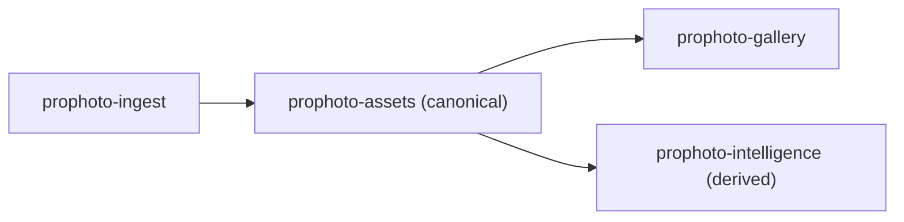

# Derived Intelligence Layer
Date: March 10, 2026
Status: Step 4 draft (boundary + data ownership + contracts/events + v1 plan)

## 1) Purpose
The Derived Intelligence Layer provides regenerable, model-driven outputs for assets (for example AI tags, scene labels, OCR text, embeddings, aesthetic scores, duplicate/face/recommendation signals) without changing canonical asset metadata.

It exists to make intelligence outputs queryable and operational while preserving Asset Spine as the source of truth for media identity and canonical metadata.

## 2) Boundary With Asset Spine and Normalized Metadata
Asset Spine (`prophoto-assets`) remains canonical:
- canonical asset identity
- raw metadata (append-only truth)
- normalized metadata schema v1 (frozen contract)
- canonical derivatives/storage linkage

Derived Intelligence Layer is non-canonical:
- stores regenerable, versioned intelligence outputs
- may be recomputed when models/prompts/generators change
- must not write into or mutate canonical normalized metadata payloads

Boundary rule:
- Intelligence consumes `asset_id` + canonical metadata as input.
- Intelligence writes only to intelligence-owned tables.
- Canonical metadata remains interpretable even if intelligence data is deleted and regenerated.

## 3) Package Placement in Architecture
Proposed package: `prophoto-intelligence` (headless foundational domain package).

Required flow placement:

```text
ingest -> assets -> galleries
               \
                -> derived-intelligence
```

Mermaid view:



Why this placement protects canonical metadata:
- `prophoto-assets` is upstream and independent; it does not depend on intelligence.
- Intelligence outputs are downstream derivatives of canonical truth.
- Galleries remain on the canonical media path and can optionally consume intelligence for UX/search/ranking without redefining canonical metadata semantics.

## 4) Dependency Direction
One-way dependency direction:
- `prophoto-contracts` -> shared contracts/events/DTOs
- `prophoto-assets` depends on `prophoto-contracts`
- `prophoto-intelligence` depends on `prophoto-contracts` + `prophoto-assets`
- `prophoto-gallery` may consume intelligence outputs through contracts/events

Forbidden direction:
- `prophoto-assets` -> `prophoto-intelligence`

## 5) What This Layer Owns
- Intelligence generation run records (inputs, model identity, status, timing)
- Generator configuration and prompt/model metadata associated with intelligence runs
- Versioned derived outputs tied to `asset_id`
- Reprocessing history across model/prompt/generator upgrades
- Intelligence-specific retrieval/query surfaces via contracts

Meaning of "retrieval/query surfaces via contracts":
- Read-oriented interfaces in `prophoto-contracts` for fetching intelligence outputs by `asset_id`.
- Query/filter capabilities for intelligence data by run/model/version (for example latest embedding for a model family).
- Consumer packages read intelligence through contract DTOs rather than direct table coupling.

## 6) What This Layer Does NOT Own
- Canonical asset identity
- Raw metadata truth
- Normalized metadata schema contract
- Canonical storage path ownership
- Gallery curation/membership ownership
- Any UI framework/panel pages (must remain headless)

## Data Ownership Model
This section defines the minimal initial data model for the Derived Intelligence Layer.

Ownership and boundary rules:
- All tables below are owned by `prophoto-intelligence`.
- Every derived record references canonical `asset_id` from Asset Spine.
- Derived tables must not modify canonical asset tables or normalized metadata payloads.
- Outputs are versioned and regenerable; model changes append new runs/results instead of overwriting history.

### 1) `intelligence_runs`
Purpose:
- Track every intelligence generator execution as a historical fact.

Conceptual fields:
- `id`
- `asset_id`
- `generator_type`
- `generator_version`
- `model_name`
- `model_version`
- `run_scope` (optional)
- `run_status`
- `started_at`
- `completed_at`
- `configuration_hash` (optional)
- `created_at`

Mutability rules:
- Immutable historical records.
- Status/timestamps may transition only during execution lifecycle; completed runs are not rewritten with new model output.
- New model/prompt/config executions create new run rows.

Relationship to `asset_id`:
- Many runs per asset are allowed and expected.

Relationship to `intelligence_runs`:
- N/A (this is the parent run table).

Model/version tracking:
- `generator_type` identifies generator family/implementation.
- `generator_version` identifies generator code/pipeline revision independent of model identity.
- `model_name` + `model_version` identify exact model lineage.
- `configuration_hash` identifies prompt/config variant for reproducibility.
- `run_scope` classifies execution intent (for example `single_asset`, `batch`, `reindex`, `migration`).

### 2) `asset_labels`
Purpose:
- Store AI-generated tags/scene labels produced by a specific run.

Conceptual fields:
- `id`
- `asset_id`
- `run_id`
- `label`
- `confidence`
- `created_at`

Mutability rules:
- Rows are immutable within a run.
- Labels are replaceable by newer runs at read time (for example selecting latest successful run), not by in-place row mutation.
- Multiple labels per asset are allowed.

Relationship to `asset_id`:
- Many label rows per asset.

Relationship to `intelligence_runs`:
- `run_id` references `intelligence_runs.id`.
- Every label row must belong to exactly one run.

Model/version tracking:
- Inherited from parent run (`generator_type`, `model_name`, `model_version`, config).
- No duplicated model metadata required on each label row in v1.

### 3) `asset_embeddings`
Purpose:
- Store embedding vectors for semantic search/retrieval generated by a specific run.

Conceptual fields:
- `id`
- `asset_id`
- `run_id`
- `embedding_vector`
- `vector_dimensions`
- `created_at`

Mutability rules:
- One embedding per asset per run.
- Embeddings are immutable per run; refreshed embeddings are written as new runs/new rows.
- Historical embeddings remain queryable for comparison and rollback.

Relationship to `asset_id`:
- Many embeddings per asset over time (across runs/models).

Relationship to `intelligence_runs`:
- `run_id` references `intelligence_runs.id`.
- Every embedding row belongs to exactly one run.

Model/version tracking:
- Model identity is sourced from parent run.
- Embeddings are model-specific by definition and must be queried with run/model context.
- Schema must remain compatible with future vector indexing strategies.

Embedding storage strategy:
- `embedding_vector` may be stored as a float array, binary blob, or database-native vector type depending on storage engine capabilities (for example pgvector, MySQL vector extensions, or external vector stores).

## Contracts and Events
This section defines contracts and domain events required for the Derived Intelligence Layer.

Ownership rules:
- Contracts and event classes are defined in `prophoto-contracts`.
- Implementations are owned by `prophoto-intelligence`.
- Events are immutable historical facts and reference stable IDs (including `asset_id`).
- Event payload shapes are stable over time; breaking changes require additive versioned events.

### Contracts

### `AssetIntelligenceGeneratorContract`
Purpose:
- Define the interface for intelligence generators.

Capabilities/responsibilities:
- Accept `asset_id` plus canonical metadata context as input.
- Execute one intelligence model run.
- Produce derived outputs (labels, embeddings, and future result types).
- Return results tied to a run context (`run_id` + generator/model identity).

Ownership:
- Contract definition: `prophoto-contracts`
- Implementations: `prophoto-intelligence` (tagging, embeddings, OCR, and future generators)

### `AssetLabelRepositoryContract`
Purpose:
- Read-oriented interface for label retrieval.

Capabilities:
- Fetch labels by `asset_id`
- Fetch labels by run/model context
- Fetch latest labels for an asset

Boundary rule:
- Consumers must use this contract and must not query intelligence tables directly.

Ownership:
- Contract definition: `prophoto-contracts`
- Implementations: `prophoto-intelligence`

### `AssetEmbeddingRepositoryContract`
Purpose:
- Read-oriented interface for embedding retrieval.

Capabilities:
- Fetch embedding by `asset_id`
- Fetch embedding by run/model context
- Fetch latest embedding for an asset

Boundary rule:
- Consumers must use this contract and must not query intelligence tables directly.

Ownership:
- Contract definition: `prophoto-contracts`
- Implementations: `prophoto-intelligence`

### Events

### `AssetIntelligenceRunStarted`
Purpose:
- Emitted when an intelligence run begins.

Payload (minimum):
- `asset_id`
- `run_id`
- `generator_type`
- `generator_version`
- `model_name`
- `model_version`

Ownership:
- Event contract/class: `prophoto-contracts`
- Emitted by: `prophoto-intelligence`

### `AssetIntelligenceGenerated`
Purpose:
- Emitted when a run completes successfully.

Payload (minimum):
- `asset_id`
- `run_id`
- `generator_type`
- `generator_version`
- `model_name`
- `model_version`
- `result_types` (for example labels, embeddings)

Ownership:
- Event contract/class: `prophoto-contracts`
- Emitted by: `prophoto-intelligence`

### `AssetEmbeddingUpdated`
Purpose:
- Emitted when a new embedding becomes available.

Payload (minimum):
- `asset_id`
- `run_id`
- `generator_type`
- `generator_version`
- `model_name`
- `model_version`

Ownership:
- Event contract/class: `prophoto-contracts`
- Emitted by: `prophoto-intelligence`

### Event Payload Design Principles
- Payloads carry stable identifiers (`asset_id`, `run_id`), not full models.
- `AssetIntelligenceRunStarted` intentionally excludes `result_types`; output families are emitted on completion events.
- Payload fields are append-only over time for compatibility.
- Existing event payload shapes are immutable after release.
- If payload structure must change incompatibly, publish a new versioned event.

## Minimal v1 Implementation Plan
This section defines the smallest practical implementation of the Derived Intelligence Layer.

v1 guardrails:
- Canonical metadata is never mutated by intelligence writes.
- No UI components are introduced in `prophoto-intelligence`.
- All intelligence writes go through `prophoto-intelligence` services/repositories.
- Consumers read intelligence data through contracts, not direct table access.

### v1 Capability Scope
Initial implementation includes:
1. AI tag generation (`asset_labels`)
2. Embedding generation (`asset_embeddings`)
3. Intelligence run tracking (`intelligence_runs`)

These capabilities use the data ownership model above and preserve historical runs/results.

### v1 Processing Pipeline
Canonical pipeline:

```text
AssetReady event
-> IntelligenceRun creation
-> Generator execution
-> Derived output persistence
-> AssetIntelligenceGenerated event
```

Trigger sources:
- Asset ingestion completion (`AssetReady`-driven async processing).
- Scheduled background processing (batch refresh jobs).
- Manual reprocessing requests (operator-triggered by asset/run scope).

Trigger behavior:
- Triggers enqueue work and create a `pending` run.
- Workers transition run state and persist outputs.
- Completion emits domain events with stable IDs and generator/model identity.

### Run Lifecycle
Run states:
- `pending`
- `running`
- `completed`
- `failed`
- `cancelled`

Lifecycle rules:
- `pending` -> `running` when worker starts execution.
- `running` -> `completed` on successful persistence of all configured outputs.
- `running` -> `failed` on generator/persistence error.
- `pending|running` -> `cancelled` on operator/system cancellation (for example stale batch aborts or rollout interruptions).
- Completed rows are immutable historical facts.

Failure and retry handling:
- Failures store error context on run record (error code/message details fields in implementation).
- Retries create a new run by default for auditability.
- Optional retry-in-place before output persistence is allowed only while run is not `completed`.
- No failed/completed run output rows are rewritten.

Partial result policy (v1):
- If a run is configured for multiple outputs (for example labels and embeddings), all configured outputs must persist successfully for `completed`.
- If any configured output fails, the run is `failed` in v1.
- Per-output partial completion is deferred to a future version and is not part of v1 semantics.

### Latest Intelligence Read Strategy
Repository contracts resolve "latest" without mutating history:
- Latest successful run for asset:
  - choose most recent `completed` run by `completed_at` (or `id` fallback) under requested generator/model filters.
- Latest embedding for model family:
  - choose most recent `completed` embedding-producing run matching requested `generator_type`/`model_name` family and optional `model_version`.
- Latest labels for asset:
  - choose labels tied to most recent `completed` label-producing run (optionally scoped by model/generator).

Read strategy rules:
- Historical run/result rows remain queryable.
- "Latest" is a query-time projection, not a destructive overwrite.

### Reprocessing Strategy
Reprocessing is append-only and version-aware:
- Model upgrades: create new run with new `model_version`.
- Generator upgrades: create new run with new `generator_version`.
- Prompt/config changes: create new run with new `configuration_hash`.

Policy:
- Existing historical runs/results are never modified for upgrades.
- Consumers can choose "latest" or pin to explicit run/model versions.
- Backfills and migrations use `run_scope` (`batch`, `reindex`, `migration`) for auditability.

### Explicitly Deferred in v1
Deferred capabilities:
- Face recognition
- OCR text extraction
- Ranking/recommendation systems
- Aesthetic scoring
- Clustering/similarity orchestration

Why deferred:
- v1 focuses on proving stable run orchestration, versioned outputs, and contract-first consumption.
- Deferred features add heavier model/storage/latency/privacy requirements and should build on a proven run + persistence foundation first.
